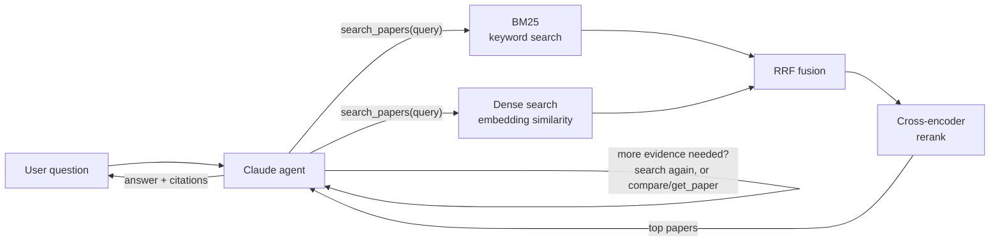

# Sift

A research assistant over arXiv: hybrid retrieval (BM25 + dense + cross-encoder rerank) feeding an
agent that decides what to search, reads the results, and answers with citations. Built to produce
a measured number, not just a working demo — every stage below is graded against a hand-labeled
query set (see [Results](#results)).

## Architecture



## What it does

Sift ingests ~2,000 recent arXiv papers into a local database, then retrieves the most relevant
ones for a question and uses them to answer in detail — with real citations back to arxiv IDs, not
invented ones. Ask a question, and instead of a single keyword search, Sift runs a multi-stage
retrieval pipeline and an LLM agent that can issue several searches, compare papers, and stop once
it has enough evidence.

## How it works

**1. Ingestion.** Pull papers from the arXiv API (title, abstract, authors, categories, dates),
normalize them, and upsert into Postgres by `arxiv_id`.

**2. Embedding.** Each paper's title + abstract is encoded into a 384-dim vector
(`BAAI/bge-small-en-v1.5`) via a hand-written tokenize → forward pass → mean-pool → L2-normalize
path (not the `sentence-transformers` one-liner — written by hand so every step is understood, not
just called), and stored in the same row via `pgvector`.

**3. Retrieval — two candidate generators, run independently per query:**
- **BM25** — keyword search. Scores documents by term overlap, weighted by how rare a term is
  across the corpus (IDF) and how often it repeats in one document (with diminishing returns), and
  normalized for document length. Catches exact terms (model names, acronyms) an embedding has no
  special mechanism for.
- **Dense retrieval** — semantic search. Embeds the query into the same vector space as the
  papers and ranks by cosine distance (`pgvector`'s `<=>` operator), so it can match meaning even
  when the wording is completely different.

**4. Fusion — Reciprocal Rank Fusion (RRF, k=60).** Combines the BM25 and dense result lists by
rank position rather than raw score — their scores aren't on comparable scales. A paper that ranks
highly in *both* lists rises to the top; this rank-based voting is what makes it "hybrid" rather
than just concatenation.

**5. Rerank — cross-encoder.** The fused top 100 candidates go through a slower, more accurate
second pass (`cross-encoder/ms-marco-MiniLM-L-6-v2`) that scores the query and each document
*together* in one forward pass, rather than comparing precomputed vectors. Too slow to run over the
whole corpus (~390ms for 100 pairs), so it only reorders the shortlist hybrid search already
narrowed down.

**6. Agent.** A Claude-powered agent (`claude-haiku-4-5`) sits on top of retrieval as a tool
(`search_papers`, `get_paper`, `compare_papers`, max 5 ids), with a 6-iteration cap enforced in
code and structured "no results" handling so it never hallucinates past a failed search.

**7. Evaluation.** Every stage above is measured against `eval/qrels.jsonl` — 1,468 graded
(query, paper) pairs across 40 queries — with nDCG@10, precision@10, recall@20, and MRR, so
retrieval quality is a reproducible number, not a vibe.

## Results

All numbers below are regenerated by the scripts in [Reproduce the evaluation numbers](#reproduce-the-evaluation-numbers) — see `eval/CHANGELOG.md` for the qrels grading methodology and two documented grading-error corrections.

**Retrieval ablation** (`results/ablation.json`, 39 graded queries):

| Variant | nDCG@10 | Precision@10 | Recall@20 | MRR | Mean latency |
|---|---|---|---|---|---|
| Dense | 0.676 | 0.790 | 0.625 | 0.950 | 41.5ms |
| BM25 | 0.466 | 0.505 | 0.414 | 0.851 | 2.7ms |
| Hybrid (RRF) | 0.639 | 0.713 | 0.564 | 0.987 | 35.8ms |
| Reranked | 0.618 | 0.664 | 0.571 | 0.957 | 446.4ms |

Open finding, not yet explained: reranked currently scores *below* hybrid on nDCG@10, the opposite
of the expected direction. Candidate causes not yet ruled out: small query count (39), unruled RRF
`k`, and the 100-candidate rerank window.

**Latency** (`results/latency_baseline.json`, p50/p95 across 39 queries × 5 repeats): the
cross-encoder rerank stage alone accounts for ~388ms of the reranked variant's ~428ms p50 — it is
the dominant cost in the pipeline by a wide margin.

**Agent eval** (`eval/agent_tasks.jsonl`, `results/agent_eval_raw.json`): 30 tasks have been run
end-to-end (citations extracted, tokens/latency/iteration counts captured per task) — citation
quality grading against `known_good_papers` is not yet complete, so no success rate is reported
here until it is.

**Cost per query**: $0.015–$0.073 (Haiku 4.5, bound not point estimate — `total_tokens` doesn't
currently separate input/output, which are priced differently; see `eval/bench_cost.py`).

### Known limitations (documented, not hidden)

- **Corpus is recency-biased**, not spread across the intended 24-month window: arXiv's API is
  sorted newest-first and `cs.CL` alone exceeds the 2,000-paper cap within days, so the corpus ends
  up narrow-and-recent rather than broad-and-2-year. Older/foundational papers a query might expect
  (e.g. "ColBERT late interaction") may be under-represented.
- **No ANN index on the embedding column** (no HNSW/IVFFlat) — dense search is a brute-force
  cosine scan via `pgvector`. Fine at 2,000 rows (~24ms); a deliberate, revisitable choice, not an
  oversight, if the corpus grows.
- **Self-agreement on hand-graded qrels has not yet been measured** — the re-grade-10%-after-two-
  days protocol from `docs/SPEC.md` §5.2 is specified but not yet run.

## Setup

Requires Python 3.11+, [`uv`](https://docs.astral.sh/uv/), and a local Postgres with the
`pgvector` extension available.

```bash
# 1. clone and install dependencies
git clone <repo-url> sift && cd sift
uv sync

# 2. create the database and enable pgvector
createdb sift
psql sift -c "CREATE EXTENSION IF NOT EXISTS vector;"

# 3. configure environment — create a .env file with:
#   DATABASE_URL=postgresql://<user>@localhost:5432/sift
#   ANTHROPIC_API_KEY=<your key>

# 4. create tables
uv run python -c "from app.models.db import init_db; init_db()"

# 5. ingest papers from arXiv (~2,000 papers, cs.IR/cs.CL, most recent)
uv run python -c "from app.ingest.arxiv_client import ingest; ingest()"

# 6. embed every paper's abstract
uv run python -c "from app.ingest.embed_papers import embed_and_write_all_embeddings; embed_and_write_all_embeddings()"
```

### Run it

```bash
# terminal chat with the agent
uv run python main.py

# local web UI (search + agent trace)
uv run uvicorn app.api.main:app --reload
# open http://localhost:8000
```

### Reproduce the evaluation numbers

```bash
uv run python -m eval.run_eval          # retrieval ablation table -> results/ablation.json
uv run python -m eval.bench_latency     # p50/p95 latency per variant -> results/latency_baseline.json
uv run python -m eval.run_agent_eval    # 30-task agent eval -> results/agent_eval_raw.json
uv run pytest                           # unit tests for metrics + retrieval correctness
```

## Repo layout

```
app/
├── api/         # FastAPI route handlers
├── ingest/      # arXiv client, normalization, embedding batch job
├── retrieval/   # bm25, dense, fusion (RRF), rerank — the graded pipeline
├── extraction/  # Pydantic schemas
├── agent/       # loop, tool registry, trace
└── models/      # db access, encoders
prompts/         # versioned agent system prompts
eval/            # metrics, qrels, run_eval.py, run_agent_eval.py, bench_latency.py
results/         # ablation tables, latency, agent eval — committed, regenerable
web/             # Phase 2 frontend
docs/            # SPEC.md (plan), ARCHITECTURE.md (why, decision by decision)
```
